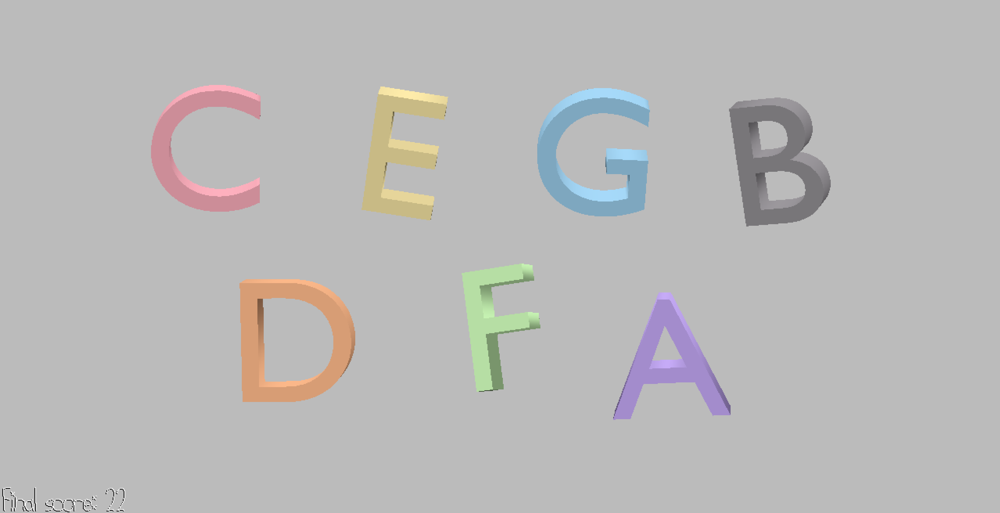

# AlphaBeat

Author: Mandy Hu

Design: My game is a note matching and rhythm game, where the player must press the
same key as the note that is jumping up and down on the screen before the next downbeat.
There is an ongoing beat in the back to help players keep track of how much time they
have to press the correct key.

Screen Shot:

How To Play: Press the key corresponding to the letter that is jumping up and
down on the screen before the next beat. Each correct letter pressed gains you
one point. The first letter will always be C. The game is over when you miss a
beat, and the background beat stops playing.

This game was built with [NEST](NEST.md).
